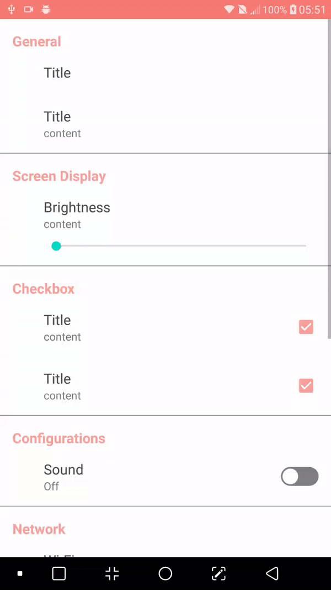
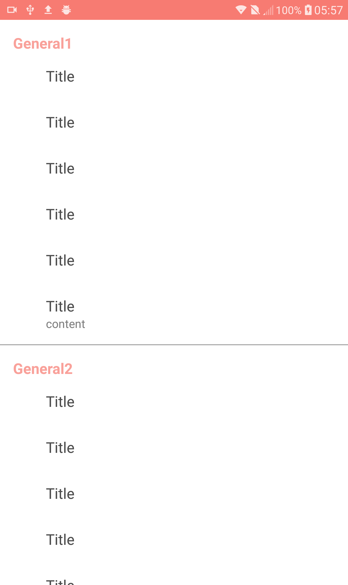
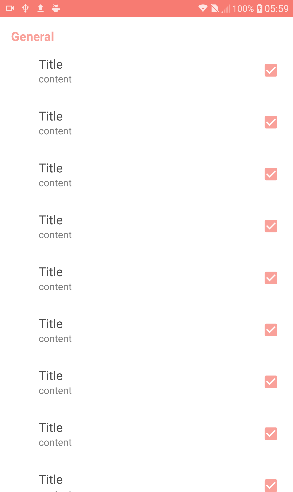
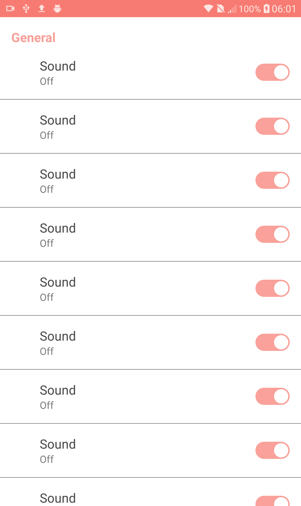
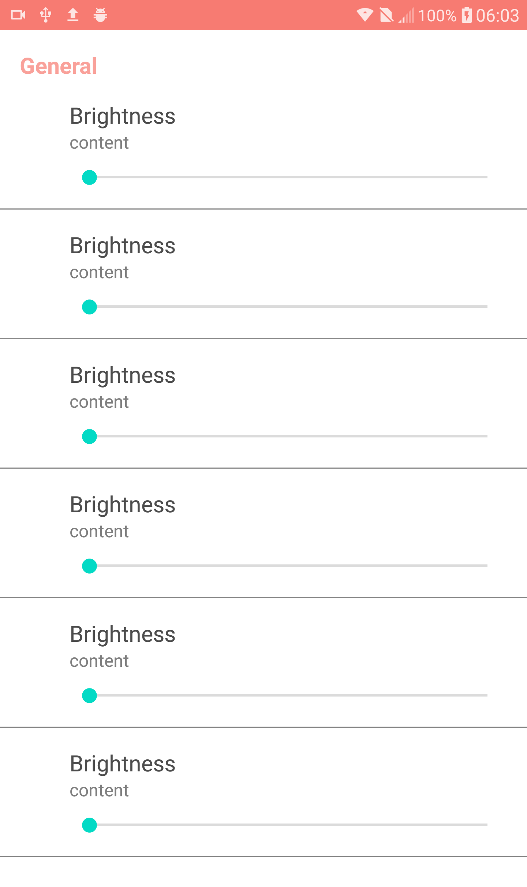
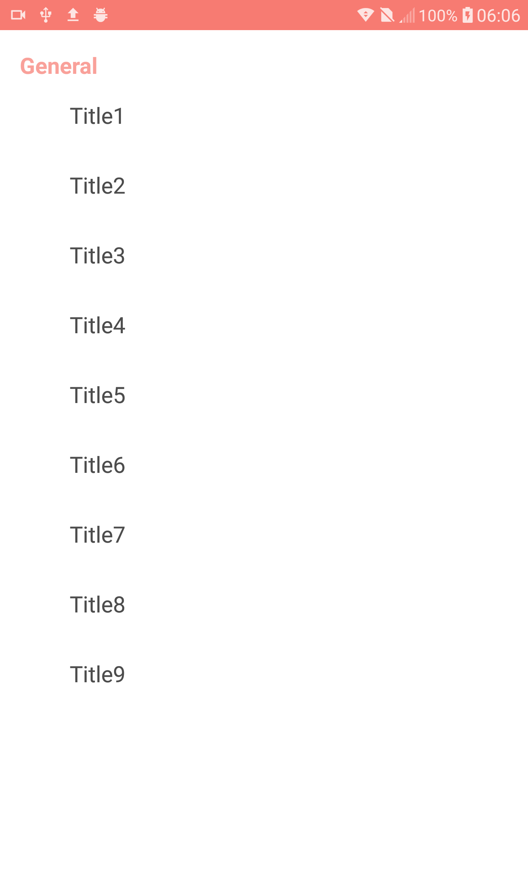

# SettingsPage
Library of settings page for Advanced Android course

[](https://jitpack.io/#AvrahamRada/SettingsPage)

## Description:
Hi :)

This is a library that can help anyone add setting page easily in their app.
I created 6 types of layouts you can add to your setting activity:

1. TITLE
2. TITLE + CONTENT
3. CHECKBOX
4. SWITCH
5. SEEKBAR
6. IMAGE

## GIF:

 

## Setup:
Step 1. Add it in your root build.gradle at the end of repositories:
```
allprojects {
    repositories {
          maven { url 'https://jitpack.io' }
    }
}
```

Step 2. Add the dependency:

```
dependencies {
      implementation 'com.github.AvrahamRada:SettingsPage:1.00.01'
}


```
## Usage

First we will need to create a collection that will contain the different types of frames we will need.

Use that to add a TITLE:
```java                    

        new Title("General")
                  .build()

```

Use that to add a TITLE + CONTENT:
```java                    

        new HeaderAndContent("Title")
                   .setSeparator(false)
                   .build()

```
Use that to add a CHECKBOX:
```java                    

        new Checkbox("Title")
                        .setContent("content")
                        .setChecked(true)
                        .setSeparator(false)
                        .build(),

```
Use that to add a SWITCH:
```java                    

        new Switch("Sound")
                        .setContent("Off")
                        .setChecked(true)
                        .setSeparator(true)
                        .build()

```
Use that to add a SEEKBAR:
```java                    

        new Seekbar("Brightness")
                        .setContent("content")
                        .build()

```
Use that to add a IMAGE:
```java                    

        new Image("Instagram")
                        .setIconDrawableId(R.drawable.instagram)
                        .setContent("Click to visit")
                        .build()

```


Of course you can edit the text and the variables and create callbacks as you prefer in your activity.







          
## License

    Copyright 2020 Avraham Rada

    Licensed under the Apache License, Version 2.0 (the "License");
    you may not use this file except in compliance with the License.
    You may obtain a copy of the License at

       http://www.apache.org/licenses/LICENSE-2.0

    Unless required by applicable law or agreed to in writing, software
    distributed under the License is distributed on an "AS IS" BASIS,
    WITHOUT WARRANTIES OR CONDITIONS OF ANY KIND, either express or implied.
    See the License for the specific language governing permissions and
    limitations under the License.
